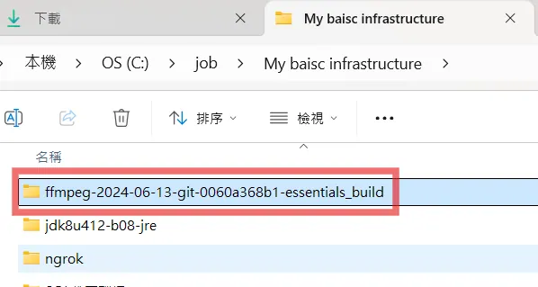
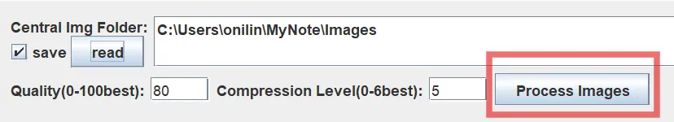

# OUTLINE

| 標題1                      | 標題2                                        | 標題3                               |
| ------------------------ | ------------------------------------------ | --------------------------------- |
| 序、當時為什麼選這個軟體             |                                            |                                   |
| 一、先安裝 MarkText 開源軟體      |                                            |                                   |
| 二、針對 MarkText 做一些環境設定    |                                            |                                   |
|                          | 1. 相對路徑 ( 圖片由快捷鍵截圖，貼上時才會塞到正確位置 )           |                                   |
|                          | 2. 編碼一定要是 UTF 8 ，否則可能遇到錯誤。                 |                                   |
| 三、建立自己的筆記 git repository |                                            |                                   |
| 四、注意事項                   |                                            |                                   |
|                          | 1. URL 使用 ctrl + L，而且必須是 forward slash = / |                                   |
|                          | 2. 檔案 ( .md ) 編碼一定要是 utf8，不可 with BOM      |                                   |
|                          | 3. 圖片不可以複製丟進來，否則會是亂碼名稱，必須使用windows內建的截圖快捷鍵 |                                   |
| 五、自製工具分享                 |                                            |                                   |
|                          | 1. 事前準備                                    |                                   |
|                          |                                            | a. JAVA 要有 JRE ( LTS 17 以上 )      |
|                          |                                            | b. 檔案編碼要設定成 UTF 8 ，如果遇到怪事可能就是編碼錯了 |
|                          |                                            | c. Git 設定中文路徑                     |
|                          |                                            | d. ffmpeg 要安裝                     |
|                          | 2. 功能介紹                                    |                                   |
|                          |                                            | tab1 ::  分別抽出圖片 / 筆記              |
|                          |                                            | tab2 ::  調整筆記 URL                 |
|                          |                                            | tab3 ::  製作大綱                     |
|                          |                                            | tab4 ::  壓縮圖片                     |

# 序、當時為什麼選這個軟體

曾經用過 typora、notion，但是都不習慣，也不想被網路綁架，所以就決定找一個開源。

這個軟體免費，雖然已經3年沒更新了，但應該還是可以用 。

主要是可以離線編輯 MarkDown 筆記，直觀的展現。

雖然有時候會有些迷之 bug  ( 文字打一打被吃回去 ) ，哈哈。

我已經很少觸發這問題了 : 

- 基本上新增行，使用滑鼠右鍵 add before / after 就可以避開。

- 以及透過 ctrl + E 以原始碼模式編輯，改完就不會回溯。

最主要是，由於他是離線軟體，所以拿來寫筆記比較有隱私 :D。

# 一、先安裝 MarkText 開源軟體


# 二、針對 MarkText 做一些環境設定

| File > 選擇Perferences |  |
| -------------------- | ------------------------------------------ |

## 1. 相對路徑 ( 圖片由快捷鍵截圖，貼上時才會塞到正確位置 )

> shift + windows + s ( windows ) 快捷鍵截圖。

| 設定相對路徑 |  |
| ------ | ------------------------------------------ |

## 2. 編碼一定要是 UTF 8 ，否則可能遇到錯誤。

| 編碼要設定UTF8 |  |
| --------- | ------------------------------------------ |

# 三、建立自己的筆記 git repository


基本上只要 push 過去 gitlab / github 就可以使用了。

# 四、注意事項

## 1. URL 使用 ctrl + L，而且必須是 forward slash = /

如果今天從另一個筆記複製下來

C:\Users\onilin\MyNote\私人小筆記\日常用品購買\3M .md

想要建立 `link` ，我通常會先寫成  forward slash = `/` ，避免丟到 gitlab 無法使用。

> 私人小筆記/日常用品購買/3M .md

---

然後利用 `ctrl + L` ，就會出現下圖這樣

| 選取後 Ctrl + L                               | 右邊框框填入 `../`                               |
| ------------------------------------------ | ------------------------------------------ |
|  |  |

要多少次 `../` 得自己判斷，最終會得到正確的 link。

> [私人小筆記/日常用品購買/3M .md](../私人小筆記/日常用品購買/3M .md)

## 2. 檔案 ( .md ) 編碼一定要是 utf8，不可 with BOM

只能夠是 單純的 UTF8，其他例如 UTF8-BOM、UTF16，都會導致自製工具的功能 :

- 抽取筆記、轉換圖片、調整圖片 URL  功能失效。

我暫時還不打算加入自動判斷，那是 v1.4 跟 v.15 的功能 XD

> - MD Extractor 1.4 希望可以自動提示 user 先關閉 筆記軟體，以及 cmd 如果有開啟 Images 要關閉 cmd 。
> 
> - MD Extractor 1.5 希望可以先判斷 user 的檔案格式，如果不是 utf8，跳出錯誤訊息

## 3. 圖片不可以複製丟進來，否則會是亂碼名稱，必須使用windows內建的截圖快捷鍵

所有圖片要貼筆記內，請使用 shift + windwos + s ，然後到筆記這邊貼上。

不可以去 FileExplorer  檔案總管找到下載好的圖片、複製圖片，貼到筆記內。

> **P.S. 透過剪取工具或者小畫家的 複製圖片，然後再 ctrl + v ，是可以的。** 


| ctrl+c 、ctrl + v 會導致亂碼名稱，<br/>不利於我的工具幫忙壓縮圖片。 |  |
| -------------------------------------------- | ----------------------------------------------------------------------------- |

# 五、自製工具分享

## 1. 事前準備

|  | [Markdown-Extractor](https://github.com/odenmeow/Markdown-Extractor) |
| ------------------------------------------ | -------------------------------------------------------------------- |

> 這個軟體可以幫助抽出筆記，可以把某層資料夾下面的筆記抽出來之後再分享給別人，或者壓縮筆記圖片。

### a. JAVA 要有 JRE ( LTS 17 以上 )

### b. 檔案編碼要設定成 UTF 8 ，如果遇到怪事可能就是編碼錯了


### c. Git 設定中文路徑

Windows 預設會在 Git log/狀態顯示時把中文 escape 成 `\346\227\245...` 這樣

記得先設定

```batch
git config --global core.quotepath false
```

### d. ffmpeg 要安裝

> 因為我有做壓縮圖片的功能

| 步驟一     |  |
| ------- | ------------------------------------------ |
| **步驟二** |  |
| **步驟三** |  |
| **步驟四** |  |
| **步驟五** |  |
| **步驟六** |  |
| **步驟七** |  |
|         | 這樣基本上就安裝成功了 !                              |

---

## 2. 功能介紹

### tab1 ::  分別抽出圖片 / 筆記

| 展示      |  |
| ------- | ------------------------------------------ |
|         | 還有一些檔案，我不想圖截那麼多。                           |
| **步驟一** |  |
| **步驟二** |  |
| **步驟三** |  |
| **步驟四** |  |
| **Tip** | 圖片 / 筆記 ，可以分別剪下貼到目標身上 ( update 筆記時 ) 。     |

### tab2 ::  調整筆記 URL

| 展示一     |                       |
| ------- | --------------------------------------------------------------- |
|         | 我把抽出後的筆記的內容都丟進去 `收納美觀用途` 裡面。                                    |
| **展示二** |                       |
|         | **由於抽出後相對路徑可能相同 也可能不同，如果不同會造成讀不到圖片!**<br>所以需要使用 auto Adjust URL |
| **步驟一** |                       |
| **步驟二** |                       |
| **步驟三** |                       |
|         |                       |
|         |                                                                 |

### tab3 ::  製作大綱

| 步驟一      |                            |
| -------- | -------------------------------------------------------------------- |
|          | 選擇 include 的話， 一個 `#` 的標題，前面會編號。<br>另外數字的部分最多是 6 層，因為標題最多 `######` 。 |
| **步驟二**  |                            |
| **效果展示** |                            |
|          | 如果重複處理，軟體會自己判斷 OUTLINE 避免重複生成。                                       |

### tab4 ::  壓縮圖片

| 步驟一     |                                                                                                       |
| ------- | ----------------------------------------------------------------------------------------------------------------------------------------------- |
| **步驟二** |                                                                                                       |
|         | 不打勾則筆記內所有.png 都轉換為 webp <br><br>預設選擇 0 天，代表今天的筆記圖片如果為 .png ， 使用軟體會把它變成webp。<br>如果填入 1 天，昨天的 .png 可被轉為 .webp<br>如果填入 2 天，前天的 .png 可被轉為 .webp，類推。 |
| **步驟三** |                                                                                                       |
|         | 丟進去之後要按下 READ                                                                                                                                   |
| **步驟四** |                                                                                                       |
|         |                                                                                                       |
| **步驟五** | 請關閉 marktext、cmd ， 如果透過 cmd 開啟 MyNote/Image 會導致無法自動移除過程中產出的 tmp 資料夾。                                                                            |
|         |                                                                                                       |
| **步驟六** |                                                                                                       |
|         | 沒關閉就會跟我一樣丟垃圾失敗，但其實應該都有轉換成功。<br>如果有關閉就會直接 successfully ...                                                                                       |
|         | 建議關閉之後再手動從 images 資料夾內把 Trash_Backup 移除就好                                                                                                       |
| 成功展示    |                                                                                                       |
