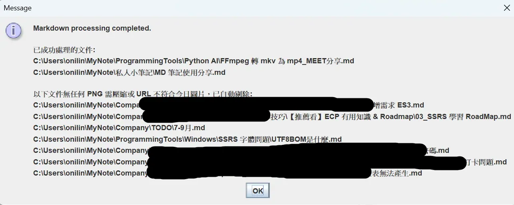

# OUTLINE

| 標題1                      | 標題2                                        | 標題3                               |
| ------------------------ | ------------------------------------------ | --------------------------------- |
| 序、當時為什麼選這個軟體             |                                            |                                   |
| 一、先安裝 MarkText 開源軟體      |                                            |                                   |
| 二、針對 MarkText 做一些環境設定    |                                            |                                   |
|                          | 1. 相對路徑 ( 圖片由快捷鍵截圖，貼上時才會塞到正確位置 )           |                                   |
|                          | 2. 編碼一定要是 UTF 8 ，否則可能遇到錯誤。                 |                                   |
| 三、建立自己的筆記 git repository |                                            |                                   |
| 四、注意事項                   |                                            |                                   |
|                          | 1. URL 使用 ctrl + L，而且必須是 forward slash = / |                                   |
|                          | 2. 檔案 ( .md ) 編碼一定要是 utf8，不可 with BOM      |                                   |
|                          | 3. 圖片不可以複製丟進來，否則會是亂碼名稱，必須使用windows內建的截圖快捷鍵 |                                   |
| 五、自製工具分享                 |                                            |                                   |
|                          | 1. 事前準備                                    |                                   |
|                          |                                            | a. JAVA 要有 JRE ( LTS 17 以上 )      |
|                          |                                            | b. 檔案編碼要設定成 UTF 8 ，如果遇到怪事可能就是編碼錯了 |
|                          |                                            | c. Git 設定中文路徑                     |
|                          |                                            | d. ffmpeg 要安裝                     |
|                          | 2. 功能介紹                                    |                                   |
|                          |                                            | tab1 ::  分別抽出圖片 / 筆記              |
|                          |                                            | tab2 ::  調整筆記 URL                 |
|                          |                                            | tab3 ::  製作大綱                     |
|                          |                                            | tab4 ::  壓縮圖片                     |

# 序、當時為什麼選這個軟體

曾經用過 typora、notion，但是都不習慣，也不想被網路綁架，所以就決定找一個開源。

這個軟體免費，雖然已經3年沒更新了，但應該還是可以用 。

主要是可以離線編輯 MarkDown 筆記，直觀的展現。

雖然有時候會有些迷之 bug  ( 文字打一打被吃回去 ) ，哈哈。

我已經很少觸發這問題了 : 

- 基本上新增行，使用滑鼠右鍵 add before / after 就可以避開。

- 以及透過 ctrl + E 以原始碼模式編輯，改完就不會回溯。

最主要是，由於他是離線軟體，所以拿來寫筆記比較有隱私 :D。

# 一、先安裝 MarkText 開源軟體


# 二、針對 MarkText 做一些環境設定

| File > 選擇Perferences |  |
| -------------------- | ------------------------------------------ |

## 1. 相對路徑 ( 圖片由快捷鍵截圖，貼上時才會塞到正確位置 )

> shift + windows + s ( windows ) 快捷鍵截圖。

| 設定相對路徑 |  |
| ------ | ------------------------------------------ |

## 2. 編碼一定要是 UTF 8 ，否則可能遇到錯誤。

| 編碼要設定UTF8 |  |
| --------- | ------------------------------------------ |

# 三、建立自己的筆記 git repository


基本上只要 push 過去 gitlab / github 就可以使用了。

# 四、注意事項

## 1. URL 使用 ctrl + L，而且必須是 forward slash = /

如果今天從另一個筆記複製下來

C:\Users\onilin\MyNote\私人小筆記\日常用品購買\3M .md

想要建立 `link` ，我通常會先寫成  forward slash = `/` ，避免丟到 gitlab 無法使用。

> 私人小筆記/日常用品購買/3M .md

---

然後利用 `ctrl + L` ，就會出現下圖這樣

| 選取後 Ctrl + L                               | 右邊框框填入 `../`                               |
| ------------------------------------------ | ------------------------------------------ |
|  |  |

要多少次 `../` 得自己判斷，最終會得到正確的 link。

> [私人小筆記/日常用品購買/3M .md](../私人小筆記/日常用品購買/3M .md)

## 2. 檔案 ( .md ) 編碼一定要是 utf8，不可 with BOM

只能夠是 單純的 UTF8，其他例如 UTF8-BOM、UTF16，都會導致自製工具的功能 :

- 抽取筆記、轉換圖片、調整圖片 URL  功能失效。

我暫時還不打算加入自動判斷，那是 v1.4 跟 v.15 的功能 XD

> - MD Extractor 1.4 希望可以自動提示 user 先關閉 筆記軟體，以及 cmd 如果有開啟 Images 要關閉 cmd 。
> 
> - MD Extractor 1.5 希望可以先判斷 user 的檔案格式，如果不是 utf8，跳出錯誤訊息

## 3. 圖片不可以複製丟進來，否則會是亂碼名稱，必須使用windows內建的截圖快捷鍵

所有圖片要貼筆記內，請使用 shift + windwos + s ，然後到筆記這邊貼上。

不可以去 FileExplorer  檔案總管找到下載好的圖片、複製圖片，貼到筆記內。

> **P.S. 透過剪取工具或者小畫家的 複製圖片，然後再 ctrl + v ，是可以的。** 


| ctrl+c ã€ctrl + v 會導致亂碼名稱，<br/>不利於我的工具幫忙壓縮圖片。 |  |
| -------------------------------------------- | ----------------------------------------------------------------------------- |

# 五、自製工具分享

## 1. 事前準備

|  | [Markdown-Extractor](https://github.com/odenmeow/Markdown-Extractor) |
| ------------------------------------------ | -------------------------------------------------------------------- |

> 這個軟體可以幫助抽出筆記，可以把某層資料夾下面的筆記抽出來之後再分享給別人，或者壓縮筆記圖片。

### a. JAVA 要有 JRE ( LTS 17 以上 )

### b. 檔案編碼要設定成 UTF 8 ，如果遇到怪事可能就是編碼錯了


### c. Git 設定中文路徑

Windows 預設會在 Git log/狀態顯示時把中文 escape 成 `\346\227\245...` 這樣

記得先設定

```batch
git config --global core.quotepath false
```

### d. ffmpeg 要安裝

> 因為我有做壓縮圖片的功能

| 步驟一     |  |
| ------- | ------------------------------------------ |
| **步驟二** |  |
| **步驟三** |  |
| **步驟四** |  |
| **步驟五** |  |
| **步驟六** |  |
| **步驟七** |  |
|         | 這樣基本上就安裝成功了 !                              |

---

## 2. 功能介紹

### tab1 ::  分別抽出圖片 / 筆記

| 展示      |  |
| ------- | ------------------------------------------ |
|         | 還有一些檔案，我不想圖截那麼多。                           |
| **步驟一** |  |
| **步驟二** |  |
| **步驟三** |  |
| **步驟四** |  |
| **Tip** | 圖片 / 筆記 ，可以分別剪下貼到目標身上 ( update 筆記時 ) 。     |

### tab2 ::  調整筆記 URL

| 展示一     |                       |
| ------- | --------------------------------------------------------------- |
|         | 我把抽出後的筆記的內容都丟進去 `收納美觀用途` 裡面。                                    |
| **展示二** |                       |
|         | **由於抽出後相對路徑可能相同 也可能不同，如果不同會造成讀不到圖片!**<br>所以需要使用 auto Adjust URL |
| **步驟一** |                       |
| **步驟二** |                       |
| **步驟三** |                       |
|         |                       |
|         |                                                                 |

### tab3 ::  製作大綱

| 步驟一      |                            |
| -------- | -------------------------------------------------------------------- |
|          | 選擇 include 的話， 一個 `#` 的標題，前面會編號。<br>另外數字的部分最多是 6 層，因為標題最多 `######` 。 |
| **步驟二**  |                            |
| **效果展示** |                            |
|          | 如果重複處理，軟體會自己判斷 OUTLINE 避免重複生成。                                       |

### tab4 ::  壓縮圖片

| 步驟一     |                                                                                                       |
| ------- | ----------------------------------------------------------------------------------------------------------------------------------------------- |
| **步驟二** |                                                                                                       |
|         | 不打勾則筆記內所有.png 都轉換為 webp <br><br>預設選擇 0 天，代表今天的筆記圖片如果為 .png ， 使用軟體會把它變成webp。<br>如果填入 1 天，昨天的 .png 可被轉為 .webp<br>如果填入 2 天，前天的 .png 可被轉為 .webp，類推。 |
| **步驟三** |                                                                                                       |
|         | 丟進去之後要按下 READ                                                                                                                                   |
| **步驟四** |                                                                                                       |
|         |                                                                                                       |
| **步驟五** | 請關閉 marktext、cmd ， 如果透過 cmd 開啟 MyNote/Image 會導致無法自動移除過程中產出的 tmp 資料夾。                                                                            |
|         |                                                                                                       |
| **步驟六** |                                                                                                       |
|         | 沒關閉就會跟我一樣丟垃圾失敗，但其實應該都有轉換成功。<br>如果有關閉就會直接 successfully ...                                                                                       |
|         | 建議關閉之後再手動從 images 資料夾內把 Trash_Backup 移除就好                                                                                                       |
| 成功展示    |                                                                                                       |

# 六、相對路徑有空白會在Git失效

通常使用

 `()[./Path]`、`()[../Path]`、`()[Path]` 裡面有空白

在本地端使用 MarkText 可以正確找到

某一版 GitHub 更新之後就不能用了

不知道 GitLab 是否也會這樣

下面提供解決方法

建議以後所有資料夾名稱、檔案名稱都不要有空白，建議用下底線替換

我這邊都是用下底線自動替換!

---

友情提示 : 

> 建立 ps1 檔案不要透過 notepad++ 
> 
> 請透過 **powershellISE** 去建立 !!
> 
> 否則可能跑不了 code。
> 
> 執行的時候需要使用 cmd 輸入
> 
> powershell -ExecutionPolicy Bypass -File "路徑"

```batch
powershell -ExecutionPolicy Bypass -File "C:\Users\qw284\Downloads\資工所-20250906T075517Z-1-001\OKstep2renameSpaceProblem_checkall_folderNameConflict.ps1"
```

## 1. Step1_change_md_content_relPath.ps1

> 請自己把 C:\MyNote 換成自己的根目錄 
> 
> (也就是放圖片 Images的爸爸 )

```batch
$rootPath = "C:\MyNote"

# ===== INTERACTIVE MODE PROMPT =====
Write-Host ""
Write-Host "是否要【直接替換】所有.md檔案中相對`路徑內容` ，[](./Path)|[](../../Path)|[](Path)，`路徑`若有空白改為底線？" -ForegroundColor Yellow
Write-Host "  Y = 直接替換（會寫回檔案）" -ForegroundColor Red
Write-Host "  N = 僅預覽（安全，不會修改任何檔案）" -ForegroundColor Green
$inputMode = Read-Host "請輸入 Y 或 N"

$ApplyReplace = $false
if ($inputMode -match '^[Yy]$') {
    $ApplyReplace = $true
}

Write-Host ""
if ($ApplyReplace) {
    Write-Host "⚠️ 目前模式：【REPLACE MODE】將直接修改檔案" -ForegroundColor Red
} else {
    Write-Host "✔ 目前模式：【PREVIEW MODE】不會修改任何檔案" -ForegroundColor Green
}
Write-Host ""

# ===== 原始全域統計（完全不動）=====
$stats = @{}

# ===== Preview 統計 =====
$previewStats = @{}
$previewTypeStats = @{}

$globalId = 0

Write-Host "--- Markdown 路徑分類（Traceable + Preview + Type Audit） ---" -ForegroundColor Cyan

Get-ChildItem -Path $rootPath -Filter "*.md" -Recurse | ForEach-Object {

    $file = $_.FullName

    try {
        $utf8 = New-Object System.Text.UTF8Encoding($false, $true)
        $content = [System.IO.File]::ReadAllText($file, $utf8)
    } catch { return }

    if ([string]::IsNullOrWhiteSpace($content)) { return }

    $lines    = $content -split "`n"
    $modified = $false
    $inCode   = $false
    $lineNo   = 0

    foreach ($line in $lines) {
        $lineNo++

        if ($line -match '^\s*```') {
            $inCode = -not $inCode
            continue
        }
        if ($inCode) { continue }

        $pattern = '(?<!\!)\[[^\]]*\]\(([^)\r\n]+)\)'

        foreach ($m in [regex]::Matches($line, $pattern)) {

            $path = $m.Groups[1].Value.Trim()
            if ($path -notmatch '\.md([?#].*)?$') { continue }

            # ===== 分類 =====
            if ($path -match '^(\.\./)+') {
                $level = ([regex]::Matches($path, '\.\./')).Count
                $key = "../ x $level"
            }
            elseif ($path -match '^\./') { $key = "./" }
            elseif ($path -match '^/')   { $key = "absolute /" }
            elseif ($path -match '^(https?|ftp)://') { $key = "absolute URL" }
            else { $key = "no prefix" }

            $globalId++

            # ===== 原始統計 =====
            if (-not $stats.ContainsKey($key)) {
                $stats[$key] = @{ count = 0; files = @{} }
            }
            $stats[$key].count++
            $stats[$key].files[$file] = $true

            # ===== Preview 統計 =====
            if (-not $previewStats.ContainsKey($key)) {
                $previewStats[$key] = @{ total = 0; affected = 0 }
            }
            $previewStats[$key].total++

            # ===== Type Audit =====
            $segments = $path -split '/'
            $folderChanged = $false
            $fileChanged   = $false

            for ($i = 0; $i -lt $segments.Count; $i++) {
                if ($segments[$i] -match ' ') {
                    if ($i -eq $segments.Count - 1) {
                        $fileChanged = $true
                    } else {
                        $folderChanged = $true
                    }
                }
            }

            $afterPreview = $path -replace ' ', '_'

            Write-Host (
                "[ADD #{0:D3}] {1}:{2}  ->  {3}  [{4}]" -f `
                $globalId, $file, $lineNo, $path, $key
            ) -ForegroundColor DarkYellow

            if ($afterPreview -ne $path) {

                $previewStats[$key].affected++

                if ($folderChanged -and $fileChanged) { $type = "mixed" }
                elseif ($folderChanged)               { $type = "folder" }
                else                                  { $type = "filename" }

                if (-not $previewTypeStats.ContainsKey($key)) {
                    $previewTypeStats[$key] = @{
                        folder   = 0
                        filename = 0
                        mixed    = 0
                    }
                }
                $previewTypeStats[$key][$type]++

                Write-Host ("    type   : {0}" -f $type) -ForegroundColor Magenta
                Write-Host ("    before : {0}" -f $path) -ForegroundColor Gray
                Write-Host ("    after  : {0}" -f $afterPreview) -ForegroundColor Cyan

                # ===== 實際替換（依模式）=====
                if ($ApplyReplace) {
                    $escapedOld = [regex]::Escape("($path)")
                    $escapedNew = "($afterPreview)"

                    if ($line -match $escapedOld) {
                        $line = $line -replace $escapedOld, $escapedNew
                        $lines[$lineNo - 1] = $line
                        $modified = $true
                    }
                }
            }
        }
    }

    # ===== 寫回檔案 =====
    if ($ApplyReplace -and $modified) {
        Write-Host ">>> WRITE BACK: $file" -ForegroundColor Red
        [System.IO.File]::WriteAllText($file, ($lines -join "`n"), $utf8)
    }
}

# ===== 原始總表 =====
Write-Host "`n--- 路徑分類總結（原始，不受 Preview 影響） ---" -ForegroundColor Cyan
foreach ($k in ($stats.Keys | Sort-Object)) {
    Write-Host "`n[$k]  出現次數: $($stats[$k].count)"
    Write-Host "  檔案數: $($stats[$k].files.Count)"
}

# ===== Preview Summary =====
Write-Host "`n--- Preview Summary（空白 → _） ---" -ForegroundColor Cyan
foreach ($k in ($previewStats.Keys | Sort-Object)) {
    Write-Host (
        "[{0}]  受影響: {1} / {2}" -f `
        $k, $previewStats[$k].affected, $previewStats[$k].total
    ) -ForegroundColor Yellow
}

# ===== Preview Type Audit =====
Write-Host "`n--- Preview Type Audit（folder / filename / mixed） 【Path的空白屬於檔名或者混合或者資料夾】---" -ForegroundColor Cyan
foreach ($k in ($previewTypeStats.Keys | Sort-Object)) {
    $t = $previewTypeStats[$k]
    Write-Host (
        "[{0}]  folder={1}, filename={2}, mixed={3}" -f `
        $k, $t.folder, $t.filename, $t.mixed
    ) -ForegroundColor Green
}

Write-Host "`n--- 掃描完成（互動式模式） ---" -ForegroundColor Cyan
```

## 2. Step2_changeFolderName.ps1

> 請自己把 C:\MyNote 換成自己的根目錄
> 
> (也就是放圖片 Images的爸爸 )

```batch
#🧠 為什麼這版一定不會再出錯？

#第一階段：只掃描、不改檔 → 不會鎖資料夾

#第二階段：掃描結束後才 rename → OS 不會拒絕

#排序規則：路徑越深先改 → 父層永遠不會被鎖住

#這是檔案系統 rename 的正確姿勢。


$rootPath = "C:\MyNote"

# ===== INTERACTIVE PROMPT =====
Write-Host ""
Write-Host "是否要【直接套用】資料夾名稱 空白 → 底線？" -ForegroundColor Yellow
Write-Host "  Y = 直接 rename（若有衝突則跳過）" -ForegroundColor Red
Write-Host "  N = 僅預覽（完全不修改）" -ForegroundColor Green
$inputMode = Read-Host "請輸入 Y 或 N"

$ApplyReplace = $false
if ($inputMode -match '^[Yy]$') {
    $ApplyReplace = $true
}

Write-Host ""
if ($ApplyReplace) {
    Write-Host "⚠️ 目前模式：【APPLY MODE】會實際 rename（不刪除）" -ForegroundColor Red
} else {
    Write-Host "✔ 目前模式：【PREVIEW MODE】只顯示、不修改" -ForegroundColor Green
}
Write-Host ""

# ===== PHASE 1：蒐集所有「名稱含空白」的資料夾 =====
$targets = @()

Get-ChildItem -Path $rootPath -Recurse -Directory | ForEach-Object {
    if ($_.Name -match ' ') {
        $targets += $_
    }
}

# ===== 由深到淺排序（超關鍵）=====
$targets = $targets | Sort-Object {
    $_.FullName.Split('\').Count
} -Descending

# ===== 統計 =====
$globalId = 0
$totalFolders     = $targets.Count
$conflictCount    = 0
$renamedCount     = 0
$skippedCount     = 0
$errorCount       = 0

Write-Host "--- Folder Rename Scan（space → _） ---" -ForegroundColor Cyan

foreach ($folder in $targets) {

    $globalId++

    $beforePath = $folder.FullName
    $afterName  = $folder.Name -replace ' ', '_'
    $afterPath  = Join-Path $folder.Parent.FullName $afterName

    $hasConflict = Test-Path $afterPath

    Write-Host ("[ID {0:D4}]" -f $globalId) -ForegroundColor DarkYellow
    Write-Host ("  before   : {0}" -f $beforePath) -ForegroundColor Gray
    Write-Host ("  after    : {0}" -f $afterPath) -ForegroundColor Cyan

    if ($hasConflict) {
        $conflictCount++
        Write-Host ("  conflict : YES (skip)") -ForegroundColor Red
        $skippedCount++
        Write-Host ""
        continue
    } else {
        Write-Host ("  conflict : no") -ForegroundColor Green
    }

    if ($ApplyReplace) {
        try {
            Rename-Item -LiteralPath $beforePath -NewName $afterName -ErrorAction Stop
            $renamedCount++
            Write-Host ("  result   : RENAMED") -ForegroundColor Green
        }
        catch {
            $errorCount++
            Write-Host ("  result   : ERROR ({0})" -f $_.Exception.Message) -ForegroundColor Red
        }
    }

    Write-Host ""
}

# ===== SUMMARY =====
Write-Host "--- Folder Rename Summary ---" -ForegroundColor Cyan
Write-Host ("掃描到含空格資料夾數 : {0}" -f $totalFolders)

if ($ApplyReplace) {
    Write-Host ("成功 rename 數       : {0}" -f $renamedCount) -ForegroundColor Green
    Write-Host ("因衝突跳過數         : {0}" -f $skippedCount) -ForegroundColor Yellow
    Write-Host ("錯誤失敗數           : {0}" -f $errorCount) -ForegroundColor Red
} else {
    Write-Host ("（PREVIEW）未做任何修改") -ForegroundColor Green
}

Write-Host "`n--- 完成 ---" -ForegroundColor Cyan
```

## 3. Step3_changeMDFileName.ps1

```batch
$rootPath = "C:\MyNote"

Write-Host "--- #3 Rename .md filenames（space → _，with Conflict Detection + Y/N） ---" -ForegroundColor Cyan
Write-Host "Root: $rootPath" -ForegroundColor Gray

# ===== 互動：Y / N =====
$mode = Read-Host "要直接套用 rename 嗎？輸入 Y 套用 / N 只預覽（建議先 N）"
$apply = $false
if ($mode -match '^[Yy]$') { $apply = $true }

if ($apply) {
    Write-Host "Mode: APPLY (Y) ✅" -ForegroundColor Green
} else {
    Write-Host "Mode: PREVIEW (N) 👀" -ForegroundColor Yellow
}

$globalId = 0
$totalMd = 0
$affectedMd = 0
$conflictCount = 0
$renamedCount = 0
$skippedCount = 0
$errorCount = 0

# 取得所有 .md 檔
Get-ChildItem -Path $rootPath -Recurse -File -Filter "*.md" | ForEach-Object {

    $totalMd++

    $md = $_
    $name = $md.Name

    # 只處理檔名含空白的 .md
    if ($name -notmatch ' ') { return }

    $globalId++
    $affectedMd++

    $dir = $md.DirectoryName
    $afterName = $name -replace ' ', '_'
    $afterPath = Join-Path $dir $afterName

    $hasConflict = Test-Path -LiteralPath $afterPath
    if ($hasConflict) { $conflictCount++ }

    Write-Host ("[ID {0:D4}]" -f $globalId) -ForegroundColor DarkYellow
    Write-Host ("  before   : {0}" -f $md.FullName) -ForegroundColor Gray
    Write-Host ("  after    : {0}" -f $afterPath) -ForegroundColor Cyan

    if ($hasConflict) {
        Write-Host ("  conflict : YES (target already exists) -> SKIP") -ForegroundColor Red
        $skippedCount++
        Write-Host ""
        return
    } else {
        Write-Host ("  conflict : no") -ForegroundColor Green
    }

    if ($apply) {
        try {
            # 用 -LiteralPath 避免特殊字元被誤判
            Rename-Item -LiteralPath $md.FullName -NewName $afterName -ErrorAction Stop
            $renamedCount++
            Write-Host ("  rename   : DONE") -ForegroundColor Green
        } catch {
            $errorCount++
            Write-Host ("  rename   : ERROR -> {0}" -f $_.Exception.Message) -ForegroundColor Red
        }
    } else {
        Write-Host ("  rename   : (preview only)") -ForegroundColor Yellow
    }

    Write-Host ""
}

Write-Host "--- #3 Summary ---" -ForegroundColor Cyan
Write-Host ("總 .md 檔案數            : {0}" -f $totalMd)
Write-Host ("檔名含空格的 .md 數      : {0}" -f $affectedMd)
Write-Host ("命名衝突（已存在）數     : {0}" -f $conflictCount)
Write-Host ("已 rename 成功數         : {0}" -f $renamedCount)
Write-Host ("因 conflict skip 數      : {0}" -f $skippedCount)
Write-Host ("rename 發生錯誤數        : {0}" -f $errorCount)

if ($apply) {
    Write-Host "`n--- 完成（已套用）---" -ForegroundColor Green
    Write-Host "提醒：你應該再跑一次 #1（修正文內 link），確保連結都跟新檔名一致。" -ForegroundColor Yellow
} else {
    Write-Host "`n--- 完成（僅預覽，未套用）---" -ForegroundColor Yellow
}
```

順便小抱怨一下 notepadd++ 真的挺爛 regex 遇到 surrogate 就偷偷失敗也不會爆錯，害我找 bug 找好久，真的要玩正規，怕遇到罕見字體，還是得用 python / ps1 去做，才能抓到，否則遇到 surrogate 字體就配對失敗，直接少抓。
