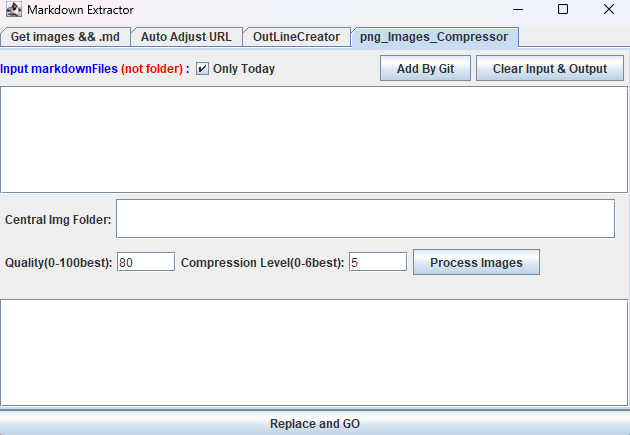

# png_Images_Compressor : 新功能

1. **轉 .png 為 .webp 格式 :**  高達 10 倍壓縮率

2. **Only Today :**  只轉換當日的 png
   
   > 如果整份 .md 皆無當日圖片，則自動剔除。
   
   > Images/2024-10-19-12-28-00-image.png ( 10-19 ) ，沒判斷年。

3. **Add By Git :**
   
   > 提供 最上層 root folder = Git 倉儲所在，自動加入有異動的筆記，

4. 調整 UI 圖層BUG
